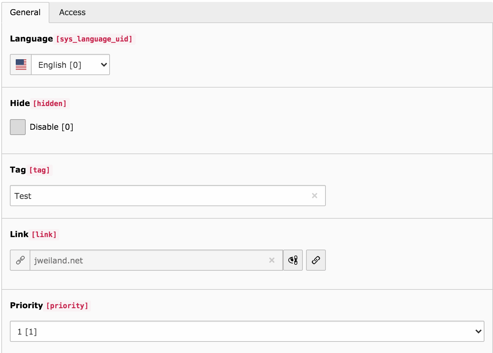

.. include:: ../Includes.txt

.. _introduction:

============
Introduction
============

Statictagcloud lets you display multiple tags which you can prioritize individually.
It comes with a plugin to display tags and its own tag entities that can be managed via the backend.

   Backend view of the Tag entity.